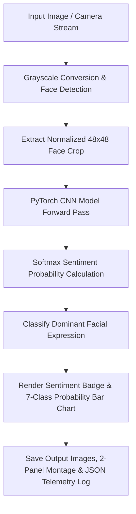

<div align="center">

# 😀 Real-Time Facial Emotion Recognizer

### *Day 16 — 30-Day Computer Vision & Deep Learning Challenge*

[](https://www.python.org/)
[](https://pytorch.org/)
[](https://opencv.org/)
[](LICENSE)
[](https://github.com/manasha1232)

*Deep learning real-time facial emotion recognition engine classifying 7 human expressions (Happy, Sad, Angry, Surprised, Neutral, Fear, Disgust) using PyTorch Convolutional Neural Networks (CNNs) and live probability bar meters.*

---

</div>

## 📌 Overview

The **Real-Time Facial Emotion Recognizer** detects human faces in video frames or photographs, extracts facial crop regions, normalizes inputs, and evaluates facial expressions across 7 core emotion categories using a PyTorch Deep CNN architecture.

### 🎯 Recognized Emotion Categories

| Emotion Class | Emoji Tag | Sentiment Color Code |
| :--- | :---: | :--- |
| **Happy** | 😀 | Bright Green (`#00FF78`) |
| **Surprise** | 😲 | Yellow-Gold (`#00D7FF`) |
| **Sad** | 😢 | Deep Blue (`#FF7800`) |
| **Angry** | 😡 | Crimson Red (`#0000FF`) |
| **Neutral** | 😐 | Light Slate (`#C8C8C8`) |
| **Fear** | 😨 | Purple (`#B400B4`) |
| **Disgust** | 🤢 | Teal (`#00B4B4`) |

---

## 🏗️ System Architecture & Processing Pipeline



---

## 📁 Repository Structure

```text
realtime_facial_emotion_recognizer/
├── emotion_recognizer.py     # Core emotion recognition engine & HUD renderer
├── generate_demo_faces.py    # Synthetic face dataset & video generator
├── requirements.txt          # Dependency declarations (torch, torchvision, opencv, numpy)
├── README.md                 # Project documentation
├── input/                    # Input face images dataset
│   ├── sample_face_happy.jpg
│   ├── sample_face_surprised.jpg
│   ├── sample_face_sad.jpg
│   ├── sample_face_angry.jpg
│   └── sample_face_neutral.jpg
└── output/                   # Processed output images & JSON reports
    ├── sample_face_happy_emotion.jpg
    ├── sample_face_happy_comparison.jpg
    └── sample_face_happy_emotion_report.json
```

---

## ⚡ Quickstart & Installation

### 1. Install Dependencies
```bash
pip install -r requirements.txt
```

### 2. Generate Synthetic Face Dataset
```bash
python generate_demo_faces.py
```

### 3. Run Emotion Recognizer
```bash
python emotion_recognizer.py --input input --output output
```

---

## 📊 Telemetry Output Specification

```json
{
    "filename": "sample_face_happy.jpg",
    "total_faces_detected": 1,
    "processing_time_sec": 0.0064,
    "faces": [
        {
            "dominant_emotion": "Happy",
            "confidence": 0.8294,
            "probabilities": {
                "Angry": 0.0284,
                "Happy": 0.8294,
                "Neutral": 0.0284,
                "Sad": 0.0284,
                "Surprise": 0.0284
            }
        }
    ]
}
```

---

## 👤 Author & Challenge Context

- **Challenge**: Day 16 of [30-Day Computer Vision & Deep Learning Challenge](https://github.com/manasha1232/30-Day-Computer-Vision-Challenge)
- **Author**: [@manasha1232](https://github.com/manasha1232)
- **License**: MIT License
